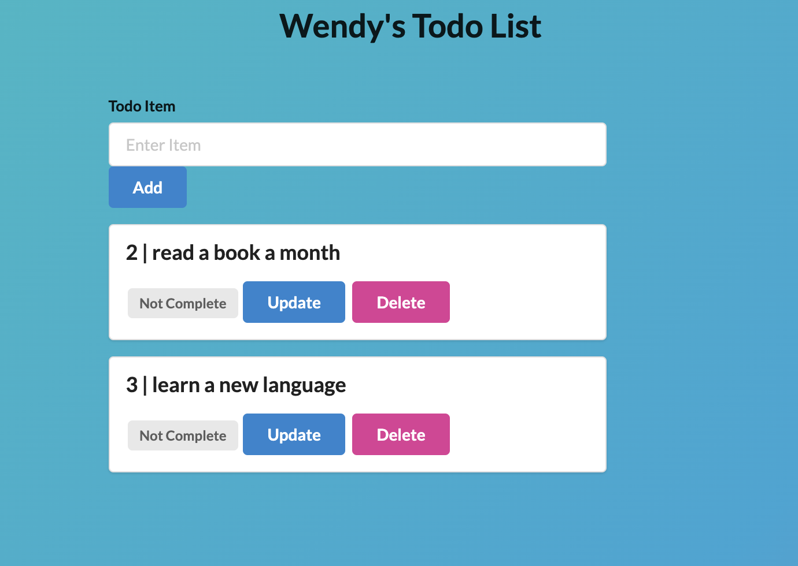

## Project Description 
This project is a simple todo app using Python programming Language, Flask Framework and Sqlite database. 

## Models
 home route --- loading page 
    
 add route --- allow me to add a new todo on to my list 
  
 update route  --- once a todo has been completed I can update it to show that it has been completed. 

 delete route  --- allow me to delete an item on my list
   

